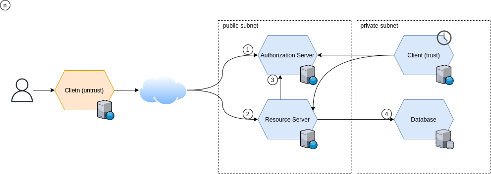

# resource-access-solution
Resource Access Solution

## Table of contents
* [Architecture design](#architecture-design)
* [Commands used](#commands-used)

## Architecture design
The next diagram is the current architecture representation(work in progress)

## Commands used
* clean and build all the gradle modules
```shell
./gradlew clean build
```
* clean and build specific gradle module (trust-client)
```shell
./gradlew :trust-client:clean build
```
* clean and build specific gradle module (resource-service)
```shell
./gradlew :resource-service:clean build
```
* clean and build specific gradle module (trust-client)
```shell
./gradlew :trust-client:bootRun
```
* clean and build specific gradle module (resource-service)
```shell
./gradlew :resource-service:bootRun
```
* build docker images locally with Jib
```shell
./gradlew jibDockerBuild
```
